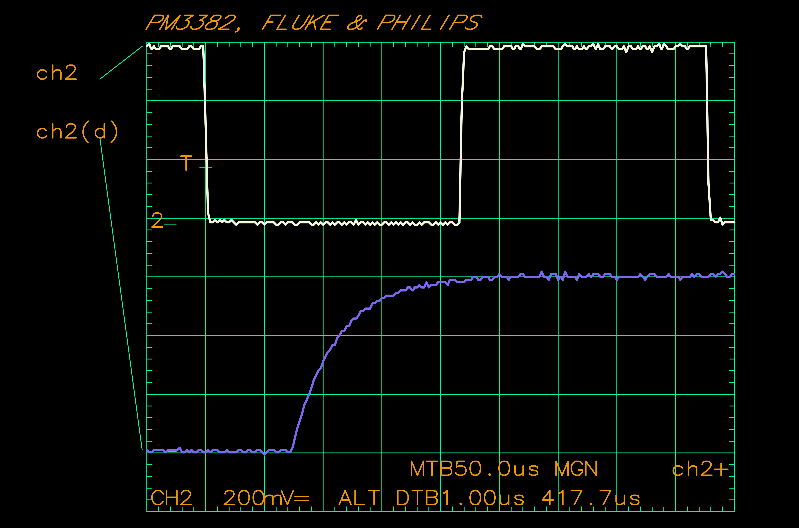

# hpglope
HPGL plotter emulator implemented in Python. It uses _pyserial_ to commuicate over serial port, and _PyCairo_ to handle drawing operations. A limited subset of HPGL v1 is implemented at the moment, but this is already enough to parse HPGL produced by Philips PM3382 oscilloscope (FW version 1993-06-12).
Many types of old digital measurement equipment are capable of plotting data using HPGL plotter connected over a usual RS232 interface. This tool can be used to 

An example of image it produces:

_This image has been plotted by Philips PM3382 using a "Plotter -> HPGL" hardcopy output set up for A3 paper size, 2:1 scale, colors enabled._

The same waveform as captured by a scope itself:

